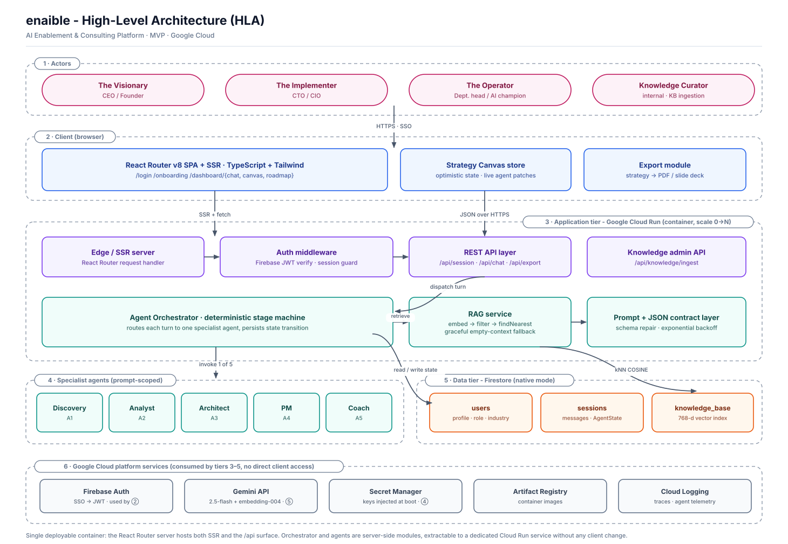
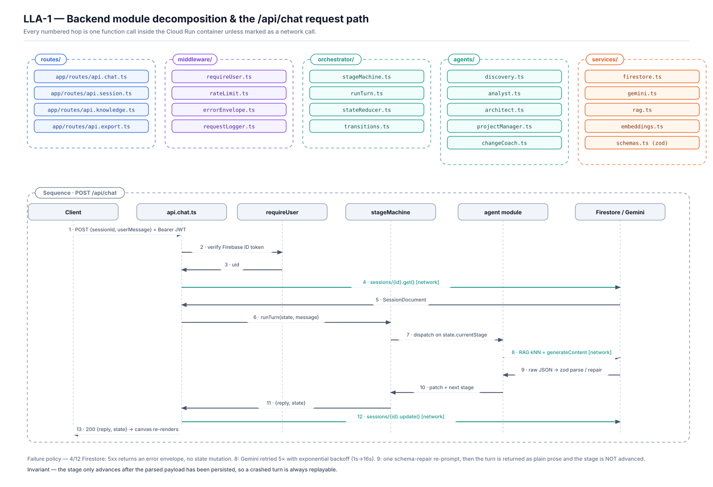
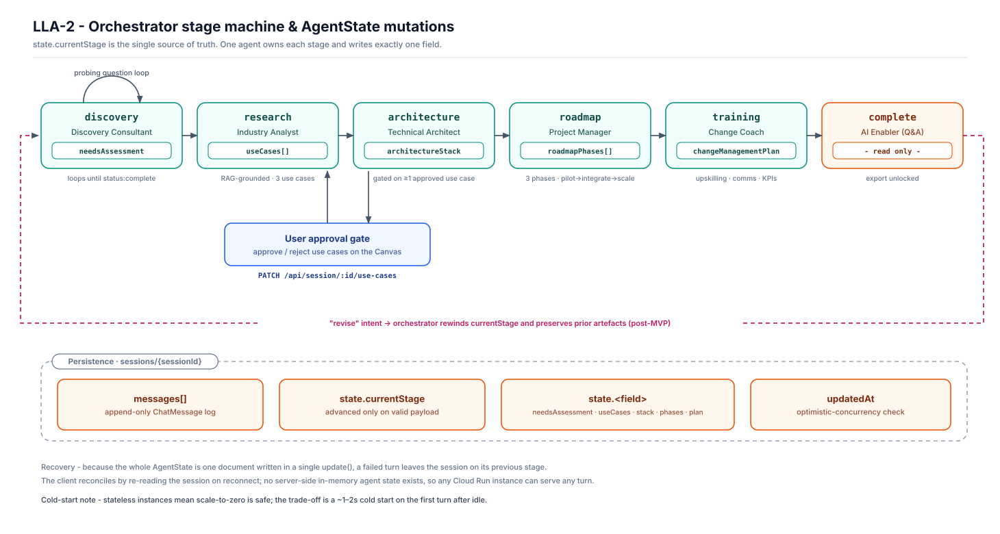
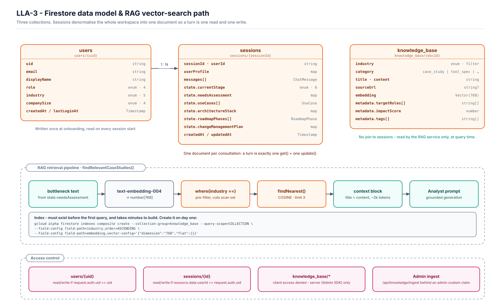
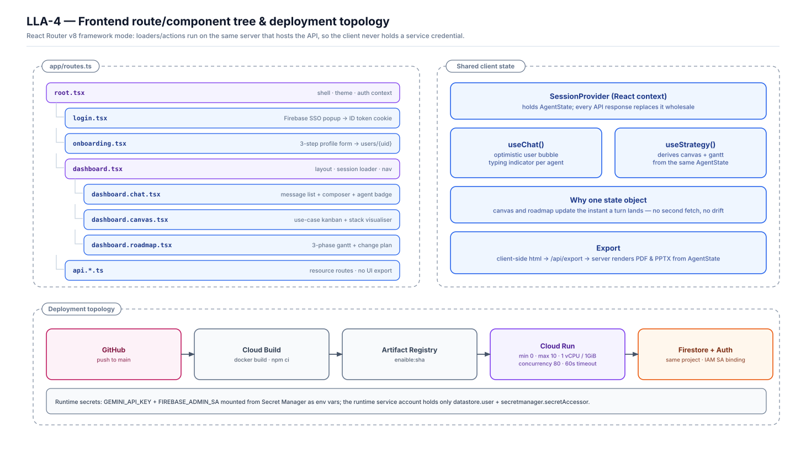

# enaible — Architecture Document

**Product:** AI Enablement & Consulting Platform
**Codename:** enaible
**Version:** 1.0 · MVP (Phase 1)
**Status:** Proposed — for hackathon build
**Source documents:** PRD v1.0, FRD v1.0, Firestore Schema & Vector Search Spec, Agent System Prompts

---

## 1. Purpose and scope

This document describes how the platform in the PRD and FRD is actually built: the runtime topology, the module boundaries, the data model, and the decisions taken where the source documents were silent or in conflict.

It covers the MVP scope only — a single-user consultation that runs five specialist agents in sequence over a Firestore-backed session and ends in an exportable strategy. Multi-user workspaces and code deployment into customer environments are explicitly out of scope, per PRD §5.

Two things in this document are decisions rather than descriptions, and are flagged as such: the collapse of "SPA + separate API service" into one Cloud Run container (§4.1), and the replacement of an LLM-routed orchestrator with a deterministic stage machine (§4.2). Everything else follows the source specs.

---

## 2. Quality attributes that drove the design

| Attribute | Target (from FRD §4 / PRD §4) | How the architecture serves it |
|---|---|---|
| Time-to-first-value | First use case in < 5 min | Discovery capped at 3–4 turns; research fires automatically on completion |
| Chat latency | TTFB < 2 s | Single Firestore read per turn; RAG pre-filtered by industry; see §9.1 for the streaming caveat |
| Scalability | Concurrent agent processing, no bottleneck | Stateless request handling; all session state in Firestore, so any instance serves any turn |
| Cost at idle | Hackathon / early-stage budget | Cloud Run scale-to-zero; Firestore on-demand; no always-on vector DB |
| Security | JWT on every endpoint | Firebase Auth ID token verified in middleware; service credentials never leave the server |
| Recoverability | A failed turn must not corrupt a consultation | Stage advances only after the parsed payload is persisted (§6.3) |

---

## 3. High-Level Architecture (HLA)



### 3.1 Reading the diagram

Six tiers, top to bottom.

**① Actors.** The three PRD personas plus one internal actor the PRD omits: someone has to put case studies into the knowledge base. Without a curator role the RAG tier has no content, and the Analyst agent degrades to generic advice — exactly the failure mode the Agent Prompts spec says to reject.

**② Client.** A React Router v8 application in framework mode with SSR enabled (this is what the existing repo scaffold already is). Three concerns live here: the routed UI, the Strategy Canvas store that mirrors `AgentState`, and the export module.

**③ Application tier.** One Cloud Run container. The React Router server handles both document requests and the `/api/*` resource routes. Behind those sit the orchestrator, the RAG service, and the prompt/JSON contract layer.

**④ Specialist agents.** Five prompt-scoped modules (FR-A1…A5). They are not separate processes or separate models — each is a system prompt, an input projection over `AgentState`, and an output schema.

**⑤ Data tier.** Three Firestore collections. `knowledge_base` carries a 768-dimension vector index for native ANN search.

**⑥ Platform.** Firebase Auth, the Gemini API on Vertex, Artifact Registry, Cloud Logging. No client code touches these directly, and no static credential exists for any of them — see §8.3.

### 3.2 The request in one sentence

A browser sends a chat turn with a Firebase ID token; the Cloud Run container verifies it, loads the one session document, hands the turn to whichever agent owns the current stage, that agent (optionally after a vector search) calls Gemini, the JSON it returns is validated and merged into `AgentState`, and the whole document is written back and returned so the Canvas re-renders.

---

## 4. Key architectural decisions

### 4.1 ADR-01 — One Cloud Run service, not two

**Context.** The FRD describes a decoupled SPA plus a containerised Node/Express API. The repository, however, is already a React Router v8 framework-mode app with `ssr: true`, which ships its own Node server.

**Decision.** Deploy one container. The React Router server hosts the UI and the `/api/*` resource routes. The orchestrator and agents are server-side modules imported by those routes.

**Consequences.**

- *Good:* one build, one deploy, one set of secrets, no CORS, no duplicated auth, and loaders can call the orchestrator in-process instead of over HTTP. On a 48-hour clock this removes an entire class of integration work.
- *Good:* the client never receives a service credential. The server calls Gemini and Firestore under Application Default Credentials, so there is no key to leak in either direction.
- *Bad:* UI traffic and agent traffic scale together. A slow agent turn occupies a request slot that also serves page loads.
- *Bad:* it diverges from the FRD as written.

**Mitigation and exit.** Cloud Run concurrency is set to 80 with a 60-second request timeout, so page loads are not starved by in-flight agent turns at MVP volume. If agent load ever needs to scale independently, `orchestrator/` and `agents/` lift out into a second Cloud Run service unchanged — the only edit is swapping the in-process call in `api.chat.ts` for a `fetch`. The module boundary in §5 exists to keep that edit to one file.

### 4.2 ADR-02 — A deterministic stage machine, not an LLM router

**Context.** The Agent Prompts spec describes an "Orchestrator Agent [that] acts as the router, calling these specialized sub-agents based on the conversation state." That can be read two ways: an LLM that decides which agent to call, or code that switches on state.

**Decision.** Code. `state.currentStage` is an enum with six values, and a `switch` selects the agent. This is what the reference implementation in the Firestore spec already does.

**Consequences.**

- *Good:* the consultation is reproducible and demoable. There is no run in which the Architect fires before Discovery has produced a bottleneck.
- *Good:* one Gemini call per turn instead of two (no routing call), which halves latency and cost on the critical path.
- *Good:* every transition is testable without a model in the loop.
- *Bad:* the user cannot say "actually, go back and redo the use cases" and have the system understand. The MVP handles this only through the explicit approval gate (§6.2); free-form revision intent is post-MVP and is drawn as the dashed edge in LLA-2.

### 4.3 ADR-03 — Google ADK deferred

**Context.** The FRD names Google ADK as the orchestration layer. ADK's mature surface is Python; the Node story is thinner, and the reference code in the Firestore spec does not use it — it calls the Gemini SDK directly.

**Decision.** Build on `@google/generative-ai` directly for the MVP, behind a thin `services/gemini.ts` seam.

**Consequences.** Fewer moving parts and no SDK-maturity risk during a sprint. The cost is that ADK's built-in tracing, tool-calling and session primitives have to be hand-rolled — which for five prompt-scoped agents with fixed transitions is roughly 150 lines. If the team later wants ADK (or a Python ADK microservice), the seam is `services/gemini.ts` plus the five agent modules; nothing in the routes or the data model changes.

### 4.4 ADR-04 — Firestore native vector search, not a dedicated vector store

**Decision.** Store embeddings in the `knowledge_base` collection and query with `findNearest()`, as the schema spec prescribes.

**Consequences.** One database, one credential, one bill, and the industry pre-filter runs in the same query as the ANN search. The ceiling is real but distant: `flat` indexing scans the filtered set, which is fine at the hundreds-to-low-thousands of documents an MVP knowledge base holds, and would need revisiting in the hundreds of thousands. Migration to Vertex AI Vector Search is a change confined to `services/rag.ts`.

### 4.5 ADR-05 — Model selection

The PRD/FRD say "Gemini 3.5". At the time this ADR was written no such model existed, and it read like a conflation of Gemini 2.5 and Claude 3.5; the reference code named `gemini-2.5-flash-preview-09-2025`.

> **Amended 2026-08-31 — the FRD was early, not wrong.** `gemini-3.5-flash` is now generally available on Vertex AI and is the model this project runs on. Two constraints, both probed rather than assumed:
>
> - **It serves only from the `global` endpoint.** `gemini-3.5-flash` in `us-central1` is a plain 404. `GCP_LOCATION` therefore defaults to `global`, and the model and the endpoint are a pair — changing one without the other breaks every agent call. The cost is data residency: `global` may serve from any region.
> - **There is no `gemini-3.5-pro`.** It 404s. Nothing may offer it, least of all the Architect's fallback model menu.
>
> Both defaults now live in one place, `app/services/gemini.ts`; `scripts/deploy.sh` passes the env vars through only when set rather than carrying its own copy, which is how the defaults drifted apart in the first place. `GET /health` reports the pair in production.

**Decision.** Pin one Flash-class model for all five agents — `gemini-3.5-flash` as of the amendment above, `gemini-2.5-flash` as originally written — and `gemini-embedding-001` at 768 output dimensions for embeddings, pinned via `outputDimensionality` to match the declared index (the model is natively 3072-d; `text-embedding-004` as originally specified was superseded). Flash is the right default: the agents produce short structured JSON, not long prose, and latency is on the critical path. Read the model id from an environment variable so it can be swapped to Pro for the Architect agent without a redeploy if output quality demands it.

**Verify before building:** model availability and exact ids change frequently. Confirm the current id in the Gemini API docs at kickoff rather than trusting this document.

---

## 5. Low-Level Architecture — modules and the request path



### 5.1 Module boundaries

| Layer | Owns | Must not |
|---|---|---|
| `app/routes/api.*.ts` | HTTP shape: parsing, status codes, error envelopes | Contain business logic or prompt text |
| `middleware/` | Auth, rate limiting, logging, error normalisation | Know about stages or agents |
| `orchestrator/` | Stage transitions, state merging | Call Gemini or Firestore directly |
| `agents/` | One system prompt + input projection + output schema each | Know about HTTP or about other agents |
| `services/` | Firestore, Gemini, embeddings, RAG, zod schemas | Contain product rules |

The single rule that keeps this honest: **an agent module receives a plain object and returns a plain object.** It never sees a request, a response, or a Firestore reference. That is what makes the five agents testable with fixtures and what makes ADR-01's exit path cheap.

### 5.2 The `/api/chat` turn

The sequence in LLA-1 is the whole hot path. Three network hops per turn: one Firestore read, one or two Gemini calls (embedding + generation, when the stage does RAG), one Firestore write.

### 5.3 Failure policy

| Step | Failure | Behaviour |
|---|---|---|
| 2 | Invalid or expired ID token | `401`, no state read |
| 4 | Firestore read fails | `503` error envelope; client retries the same turn safely |
| 8 | Gemini 429/5xx | 5 retries, exponential backoff 1s → 16s, then `503` |
| 8 | Gemini hard timeout | Turn abandoned; stage unchanged; user sees "that took too long, try again" |
| 9 | Response is not valid JSON for the stage schema | One repair re-prompt with the zod error appended. If it fails again, the raw text is returned as a normal chat message and **the stage does not advance** |
| 12 | Firestore write fails | `503`; the user's message is lost but the session is intact and consistent |

The invariant behind all of it: **the stage advances only after the parsed payload has been persisted.** A crashed turn is always replayable, which matters more in a live demo than any amount of error copy.

---

## 6. Low-Level Architecture — the stage machine



### 6.1 Stages and ownership

Each stage has exactly one owning agent that writes exactly one field of `AgentState`. Nothing else writes that field. This is what lets the Canvas render from `AgentState` alone without reconciling partial updates.

| Stage | Agent | Writes | Exit condition |
|---|---|---|---|
| `discovery` | Discovery Consultant (FR-A1) | `needsAssessment` | Model emits `{"status":"complete", …}` |
| `research` | Industry Analyst (FR-A2) | `useCases[]` | 3 use cases parsed |
| `architecture` | Technical Architect (FR-A3) | `architectureStack` | Stack + security parsed |
| `roadmap` | Project Manager (FR-A4) | `roadmapPhases[]` | 3 phases parsed |
| `training` | Change Coach (FR-A5) | `changeManagementPlan` | Plan parsed |
| `complete` | Q&A fallback | nothing | — |

### 6.2 The approval gate — a gap in the source documents

PRD Epic 2 says: *"As a user, I want to approve or reject suggested use cases to refine my strategy."* The reference orchestrator in the Firestore spec advances `research → architecture` automatically, with no approval step. The two documents contradict each other, and the PRD wins — approval is the moment the product stops being a chatbot and starts being a consultation.

**Design.** After `research` writes `useCases[]`, the Canvas renders them with approve/reject controls. `PATCH /api/session/:id/use-cases` sets each `status` to `approved` or `rejected`. The `architecture` stage refuses to run while zero use cases are approved and returns a nudge instead. The Architect agent then receives only the approved subset.

This costs one endpoint and one guard clause, and it is the difference between demoing a pipeline and demoing a product.

### 6.3 Detecting stage completion

The reference code checks `replyText.includes('"status": "complete"')`. That is brittle — it depends on the model's exact whitespace, and `includes('identified_bottleneck')` will fire on a model that merely mentions the phrase.

**Design.** For `discovery`, request `responseMimeType: 'application/json'` with a two-branch schema: either `{"status":"asking","question":"…"}` or `{"status":"complete","summary":…,"primary_objective":…,"data_readiness":…,"identified_bottleneck":…}`. Parse with zod and branch on the discriminant. The other four stages already use JSON mode in the reference code; validate all five the same way.

### 6.4 Concurrency

Two browser tabs on one session can interleave writes. The MVP takes the cheap defence: the client sends the `updatedAt` it last saw, and the server rejects the turn with `409` if it no longer matches. A Firestore transaction is the correct fix and is a post-MVP item.

---

## 7. Low-Level Architecture — data model and retrieval



### 7.1 Why the session is one denormalised document

Everything a consultation produces lives in one `sessions/{sessionId}` document: the message log and the full `AgentState`. A turn is one `get()` and one `update()`.

The trade-off is Firestore's 1 MiB document limit, which the message array will eventually approach. At ~1 KB per message that is roughly a thousand turns — far beyond a single consultation, so it is not an MVP concern. The moment it becomes one, `messages` moves to a `sessions/{id}/messages` subcollection and `state` stays on the parent; the agents are unaffected because they only ever see the last six messages.

**One correction to the schema spec:** `SessionDocument` as written omits `userProfile`, but the reference orchestrator reads `sessionData.userProfile` on every turn. Add it to the interface:

```ts
export interface SessionDocument {
  sessionId: string;
  userId: string;
  userProfile: { name: string; role: UserProfile['role']; industry: UserProfile['industry'] };
  createdAt: FirebaseFirestore.Timestamp;
  updatedAt: FirebaseFirestore.Timestamp;
  messages: ChatMessage[];
  state: AgentState;
}
```

Denormalising the profile onto the session is deliberate: it saves a `users` read on every turn, and a consultation should reflect the profile as it was when the session started.

### 7.2 Retrieval

The pipeline is: bottleneck text → `text-embedding-004` → `where('industry','==',…)` → `findNearest(embedding, COSINE, limit 3)` → a ~2k-token context block → the Analyst prompt.

The industry equality filter is not a nicety. It is what makes a flat index viable, and it is why the composite index declares `industry` ASCENDING alongside the vector config. **The index must exist before the first query and takes minutes to build — create it on day one, not at demo time.**

When retrieval returns nothing, the reference code logs a warning and proceeds with an empty context. Keep that behaviour, but surface it: the Analyst prompt should be told when it is running ungrounded, and the response should be marked as such rather than silently presenting invented case studies as researched ones.

### 7.3 Access control

| Path | Rule |
|---|---|
| `users/{uid}` | read/write if `request.auth.uid == uid` |
| `sessions/{id}` | read/write if `resource.data.userId == request.auth.uid` |
| `knowledge_base/*` | no client access; server-side Admin SDK only |
| `POST /api/knowledge/ingest` | admin custom claim required |

The ingest endpoint in the reference code has **no authentication at all**. As written, anyone who finds the URL can write into the corpus that grounds every customer's advice — a content-poisoning path straight into the product's core value. Gate it before the service is ever public.

---

## 8. Low-Level Architecture — frontend and deployment



### 8.1 Client state

One `AgentState` object in a React context. Every API response replaces it wholesale; the Canvas and the roadmap derive their views from it. There is no second fetch and no partial merge, so the "real-time updates" requirement in FRD §2.2 falls out of the design rather than needing machinery: when a turn lands, the use cases appear on the Canvas in the same render.

### 8.2 Export

FRD §3 lists no export endpoint, but PRD Epic 3 requires PDF and slide-deck export. `POST /api/export` takes the session id and a format, renders `AgentState` server-side, and returns a file. Server-side rendering (rather than client-side) keeps the layout consistent and means the export path can later be reused by a scheduled email without a browser in the loop.

### 8.3 Deployment

GitHub → Cloud Build → Artifact Registry → Cloud Run, same project as Firestore and Firebase Auth.

Cloud Run: min instances 0, max 10, 1 vCPU / 1 GiB, concurrency 80, 60 s timeout. Scale-to-zero is deliberate and its cost is a 1–2 second cold start on the first turn after idle — acceptable for MVP, and worth setting min instances to 1 for the hour around a live demo.

**Credentials: ADC, no secrets.** Both Gemini and Firestore are reached with Application Default Credentials — the runtime service account via the Cloud Run metadata server in production, and `gcloud auth application-default login` on a developer machine. Gemini therefore runs against Vertex AI rather than the Gemini Developer API, which is key-only.

This removes Secret Manager from the MVP entirely: there is no API key, no admin service-account JSON, and nothing to rotate, mount, or accidentally commit. The runtime service account holds `aiplatform.user` and `datastore.user` and nothing else.

**Repository defect to fix first:** the existing `Dockerfile` runs `npm ci` against `package-lock.json`, but the repo ships `pnpm-lock.yaml` and no npm lockfile. The build fails as committed. Either switch the Dockerfile to `corepack enable && pnpm install --frozen-lockfile`, or generate and commit a `package-lock.json`. Pick one and delete the other lockfile — keeping both guarantees drift.

---

## 9. Non-functional requirements — status against the FRD

### 9.1 Performance: the streaming conflict

FRD §4 asks for TTFB < 2 s "utilizing streaming responses where possible." The four structured stages **cannot** stream usefully: their output is a JSON document that must be complete and schema-valid before it means anything, and the client can do nothing with half of it.

**Position.** Only `discovery` streams, because it emits conversational prose. The four structured stages return whole and are covered by an agent-labelled progress indicator ("Industry Analyst is reviewing 3 case studies…") rather than by token streaming. That satisfies the perceived-latency intent behind the requirement; a literal reading of it does not survive contact with JSON-mode generation.

Measured expectation per structured turn: ~200 ms Firestore read, ~300 ms embedding (research stage only), 1.5–4 s generation, ~150 ms write.

### 9.2 Security

JWT verification on every `/api/*` route (FRD §4). Beyond that, four things the source documents do not mention and the MVP should still carry: the unauthenticated ingest endpoint (§7.3); per-user rate limiting, since each turn is a paid model call and an unthrottled loop is a billing incident; a cap on user message length before it reaches a prompt; and no logging of full prompts containing customer business detail into Cloud Logging.

Prompt injection deserves a named position rather than silence. User text and retrieved knowledge-base content both enter the prompt. The MVP's defence is structural, not filtering: agents produce JSON validated against a fixed schema, so an injected instruction cannot make the Architect emit a phase array or a link; and no agent has tools, so there is nothing to hijack beyond the text of one turn's output. That is adequate for single-tenant MVP and inadequate the moment agents get tools or sessions get shared.

### 9.3 Scalability

Stateless request handling means horizontal scale is a Cloud Run setting. The real limit is the Gemini API quota, not the container: five agents at one call per turn against a per-minute project quota is the first ceiling anyone hits. Know that number before a public demo.

---

## 10. Open risks

| # | Risk | Impact | Response |
|---|---|---|---|
| R1 | Knowledge base is thin or empty at demo time | Analyst produces generic advice — the exact output the prompt spec forbids | Treat 20–30 seed documents across the five industries as a hard day-one deliverable, not a stretch goal |
| R2 | Model returns malformed JSON mid-demo | Stage stalls | JSON mode + zod + one repair re-prompt; never advance on an unparsed payload |
| R3 | Vector index not built when the first query runs | `findNearest` errors | Create the index on day one; the RAG fallback keeps the flow alive if it is late |
| R4 | Gemini model id drifts or preview model is withdrawn | Total outage | Model id in an env var; verify at kickoff |
| R5 | Cold start on the first demo turn | Awkward pause | Set min instances to 1 before the demo; warm the session beforehand |
| R6 | Five sequential agents exceed the 5-minute time-to-value KPI | KPI miss | The KPI is measured to the *first use case* (end of `research`), which is 2–4 turns in — reachable. The full plan is not, and the PRD does not ask it to be |
| R7 | Cost per consultation is unmeasured | Budget surprise | Log token counts per turn from day one; the number is needed for pricing anyway |

---

## 11. What this architecture does not do

Stated plainly so nobody discovers it late:

- No streaming on structured stages (§9.1).
- No free-form "go back and change that" — only the explicit use-case approval gate (§6.2).
- No multi-user collaboration; sessions belong to one uid (PRD §5).
- No code generation or deployment into customer environments (PRD §5).
- No automated knowledge-base ingestion; the corpus is hand-curated.
- No evaluation harness for agent output quality. For a hackathon that is the right call; for a product it is the first thing to add, because nothing here currently detects the Analyst getting quietly worse.

---

## Appendix A — API surface (MVP)

| Method | Path | Auth | Purpose |
|---|---|---|---|
| `GET` | `/health` | none | Cloud Run readiness probe |
| `POST` | `/api/session/start` | JWT | Create a session, return the Discovery greeting |
| `GET` | `/api/session/:id` | JWT + owner | Rehydrate a session |
| `POST` | `/api/chat` | JWT + owner | One turn through the stage machine |
| `PATCH` | `/api/session/:id/use-cases` | JWT + owner | Approve / reject use cases (§6.2) |
| `POST` | `/api/export` | JWT + owner | Render `AgentState` to PDF or PPTX |
| `POST` | `/api/knowledge/ingest` | JWT + admin claim | Embed and store a knowledge document |

## Appendix B — Environment variables

| Name | Source | Notes |
|---|---|---|
| `GCP_PROJECT_ID` | env | Vertex, Firestore, and Auth project |
| `GCP_LOCATION` | env | Default `global` — required by `gemini-3.5-flash`, which 404s in a region |
| `GEMINI_TEXT_MODEL` | env | Default `gemini-3.5-flash`; `GET /health` reports the live value |
| `GEMINI_EMBEDDING_MODEL` | env | `gemini-embedding-001`, pinned to 768 dimensions |
| `GCP_PROJECT_ID` | env | Firestore + Auth project |
| `EMBEDDING_DIMENSIONS` | env | `768`; pinned via `outputDimensionality` so it always matches the index |
| `RAG_TOP_K` | env | Default 3 |
| `MAX_TURNS_PER_MINUTE` | env | Per-user rate limit |

## Appendix C — Traceability

| Requirement | Where it is served |
|---|---|
| FR-A1…A5 (FRD §3.2) | §6.1, `agents/` modules |
| Firestore collections (FRD §3.3) | §7.1, LLA-3 |
| Vector RAG (Schema spec §3–5) | §7.2, LLA-3 |
| SSO login (PRD Epic 1) | §3.1 ②, Firebase Auth |
| Profiling (PRD Epic 1) | `users/{uid}`, `/onboarding` |
| Discovery chat (PRD Epic 2) | `discovery` stage |
| 3–5 use cases (PRD Epic 2) | `research` stage |
| Approve / reject (PRD Epic 2) | §6.2 — **added**, absent from the reference code |
| Tech stack recommendation (PRD Epic 3) | `architecture` stage |
| Phased roadmap (PRD Epic 3) | `roadmap` stage |
| PDF / deck export (PRD Epic 3) | §8.2 — **added**, absent from the FRD |
| Change management (Prompt spec §5) | `training` stage |
