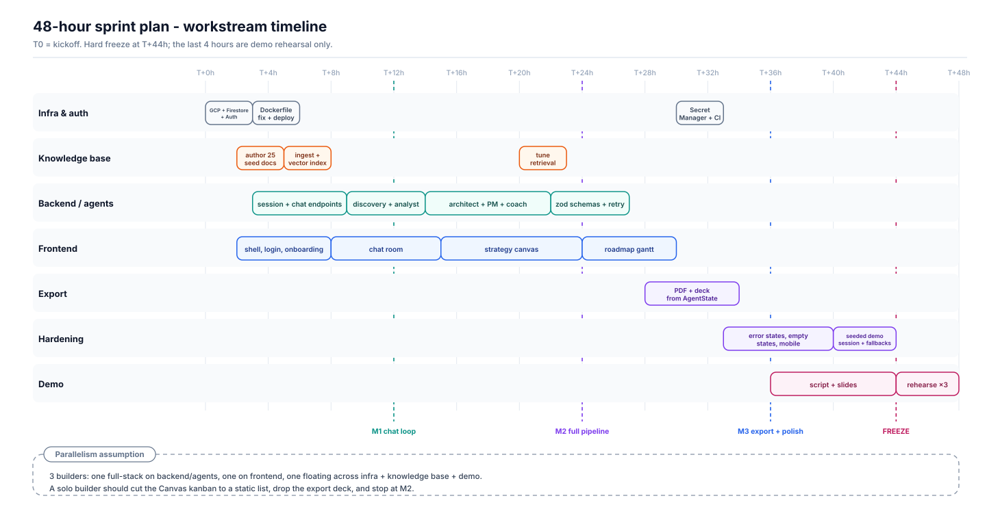

# enaible — 48-Hour Implementation Plan

**Product:** AI Enablement & Consulting Platform
**Scope:** MVP (PRD Phase 1), hackathon sprint
**Companion document:** Architecture Document v1.0
**Starting point:** `enaible/` — a React Router v8 framework-mode scaffold, one commit, no application code

---

## 1. The bet

In 48 hours you cannot build the product in the PRD. You can build **one consultation that runs end to end and produces a document a real executive would keep** — and that is what wins, because it is the only thing that proves the concept.

So the plan optimises for a single unbroken path: sign in → profile → discovery chat → three researched use cases → approve them → tech stack → roadmap → change plan → export. Everything not on that path is negotiable, and §7 says exactly what gets cut and in what order.

---

## 2. Timeline



Four checkpoints. Each is a demonstrable state, not a percentage.

| | When | Definition of done |
|---|---|---|
| **M1** | T+12h | A signed-in user types a message and the Discovery Consultant answers. Deployed on Cloud Run, not just localhost. |
| **M2** | T+24h | All five stages run end to end. The Canvas shows use cases and a tech stack. Grounded in real retrieved documents. |
| **M3** | T+36h | Roadmap view, approval gate, and export working. The whole flow survives a stranger using it. |
| **Freeze** | T+44h | No new code. Last four hours are rehearsal only. |

**M1 is the milestone that matters.** A deployed, authenticated, single-agent chat at T+12h means the remaining agents are repetitions of a solved problem. Miss M1 and the sprint is in trouble regardless of how much code exists.

---

## 3. Hour zero — the four things that block everything

Do these first, in parallel, before any feature work. Each has a long lead time or blocks a whole workstream.

1. **Fix the Dockerfile.** As committed it runs `npm ci` against `package-lock.json`, but the repo ships `pnpm-lock.yaml`. The build fails today. Switch to `corepack enable && pnpm install --frozen-lockfile`, or generate a `package-lock.json` — then delete the other lockfile.
2. **Create the Firestore vector index.** It takes minutes to build and every RAG query fails until it exists. Run the `gcloud alpha firestore indexes composite create` command from the schema spec now, so it is ready when the Analyst agent is.
3. **Confirm the Gemini model id.** *(Amended 2026-08-31: `gemini-3.5-flash` now exists and is the model this project uses. It is available only from the `global` endpoint — a 404 in any region — and there is no `gemini-3.5-pro`.)* Run `node --env-file=.env scripts/verify-kickoff.mjs`, which probes the configured model at the configured `GCP_LOCATION` and so catches a model/endpoint mismatch before anyone writes a prompt against it.
4. **Deploy the empty scaffold to Cloud Run.** Get one URL serving the untouched starter page. Every deployment problem you will have — build, secrets, service account, region — is cheaper to find now than at T+40h.

If all four are green by T+3h the sprint is on rails.

---

## 4. Workstream A — Infrastructure and auth

**Owner:** the floating builder. **Window:** T+0 → T+8, then T+30 → T+33.

| Task | Window | Done when |
|---|---|---|
| GCP project, Firestore (native mode), Firebase Auth with Google + Microsoft providers | T+0→3 | A test user can obtain an ID token |
| Dockerfile fix, first Cloud Run deploy, health check | T+3→6 | `/health` returns 200 from the public URL |
| `requireUser` middleware verifying the Firebase ID token | T+6→8 | An unauthenticated `/api/chat` returns 401 |
| Grant the runtime SA `aiplatform.user` + `datastore.user`; Cloud Build trigger on `main` | T+30→33 | No credential anywhere — ADC only; push to main redeploys |

**Note on auth.** Firebase client SDK does the SSO popup and holds the ID token. Send it as a `Bearer` header on every API call; the server verifies with the Admin SDK. Do not build a custom session-cookie scheme in a 48-hour sprint — it is a full evening of work for no demo value.

---

## 5. Workstream B — Knowledge base

**Owner:** the floating builder. **Window:** T+2 → T+8, then T+20 → T+23.

This is the workstream most likely to be skipped and the one whose absence is most visible. An Analyst agent with an empty corpus produces exactly the generic advice the prompt spec says to reject — "use ChatGPT to write emails" — and a judge or a customer spots it instantly.

| Task | Window | Done when |
|---|---|---|
| Author 20–30 seed documents: 4–6 real AI case studies per industry (Healthcare, Finance, Manufacturing, Retail, SaaS), each 150–300 words with an outcome metric | T+2→5 | Documents exist as JSON with `industry`, `category`, `title`, `content`, `metadata` |
| Build `/api/knowledge/ingest` + a `seed.ts` script; run it | T+5→8 | 25+ documents in `knowledge_base`, each with a 768-d embedding |
| Retrieval tuning: check top-3 results for five representative bottlenecks per industry | T+20→23 | Retrieved documents are visibly relevant to the query |

**Depth beats breadth.** Five excellent Healthcare documents make a Healthcare demo sing. Two shallow documents per industry make every demo mediocre. If time is short, cover one industry properly and demo in that industry.

**Gate the ingest endpoint.** The reference implementation has no auth on it at all — anyone who finds the URL can poison the corpus that grounds every user's advice. Add the admin claim check when you build it, not later.

---

## 6. Workstream C — Backend and agents

**Owner:** the backend builder. **Window:** T+3 → T+27.

| Task | Window | Done when |
|---|---|---|
| `services/firestore.ts`, `services/gemini.ts` with retry/backoff | T+3→5 | A test route round-trips a Gemini call |
| `POST /api/session/start`, `GET /api/session/:id` | T+5→7 | A session document appears in Firestore with the greeting message |
| `POST /api/chat` skeleton + `orchestrator/stageMachine.ts` | T+7→9 | The turn loop runs with a stub agent |
| **Agent 1 — Discovery** (`discovery`) with the two-branch JSON schema | T+9→12 | Asks one question at a time; emits `status:complete` and transitions — **M1** |
| **Agent 2 — Analyst** (`research`) + `services/rag.ts` | T+12→14 | Three use cases generated from retrieved documents |
| **Agents 3–5** — Architect, Project Manager, Change Coach | T+14→22 | Full pipeline reaches `complete` — **M2** |
| `services/schemas.ts` (zod) for all five outputs + one repair re-prompt | T+22→27 | A deliberately malformed response is caught and repaired, and never advances the stage |

### Build the agents in the same shape, five times

Each agent module is three things: a system prompt (lift them verbatim from the Agent System Prompts document — they are already good), an input projection over `AgentState`, and a zod output schema. Same signature every time:

```ts
export async function run(input: Input): Promise<Output>
```

No HTTP, no Firestore, no knowledge of other agents. Once Discovery is done, agents 2–5 are largely copy-adapt work — which is why the plan gives four agents only 10 hours after giving the first one 3.

### Two corrections to make while implementing

**Detect completion with a schema, not a string match.** The reference code checks `replyText.includes('"status": "complete"')` and `includes('identified_bottleneck')`, which fires on any response that merely mentions the phrase. Use `responseMimeType: 'application/json'` with a discriminated union — `{status:"asking"}` or `{status:"complete", …}` — and branch on the parsed discriminant.

**Advance the stage only after the write succeeds.** This is the invariant that makes a failed turn replayable, and it is worth the ten minutes of care during a sprint where the demo will be run live.

---

## 7. Workstream D — Frontend

**Owner:** the frontend builder. **Window:** T+2 → T+30.

| Task | Window | Done when |
|---|---|---|
| App shell, Tailwind theme, routes, `SessionProvider` | T+2→5 | Route tree from LLA-4 navigable with placeholder pages |
| `/login` with Firebase SSO; `/onboarding` three-step profile form | T+5→8 | A new user signs in, fills the profile, lands on the dashboard |
| `/dashboard/chat`: message list, composer, per-agent badge, typing indicator | T+8→15 | Real conversation with the Discovery Consultant |
| `/dashboard/canvas`: use-case cards with impact/complexity, approve/reject, stack panel | T+15→24 | Cards appear the moment `research` completes; approval calls the PATCH endpoint |
| `/dashboard/roadmap`: three-phase timeline + change management plan | T+24→30 | Roadmap renders from `roadmapPhases[]` |

**The agent badge is the product.** A chat window is a chat window; "Industry Analyst is reviewing 3 case studies…" with a named agent handing off to another named agent is what makes it read as a consulting firm. It costs almost nothing and it is the single highest-leverage piece of UI in the build. Do not let it slip.

**Skip the Gantt library.** The FRD says Gantt chart; a horizontal three-phase timeline in CSS grid conveys the same thing in one hour instead of six. Note the substitution and move on.

---

## 8. Workstream E — Export, hardening, demo

**Owner:** shared. **Window:** T+28 → T+48.

| Task | Window | Done when |
|---|---|---|
| `POST /api/export` → PDF from `AgentState` | T+28→32 | A generated PDF opens and reads well |
| Slide-deck export (PPTX) | T+32→34 | Optional — first thing to cut |
| Empty states, error states, mobile layout | T+33→40 | No blank screen anywhere; every failure shows a message |
| **Seeded demo session** in Firestore, fully completed | T+40→44 | A known-good session id loads the full strategy instantly |
| Demo script + slides | T+36→44 | Written down, not improvised |
| Rehearse three times end to end | T+44→48 | Three clean runs, one of them on the venue wifi |

**The seeded demo session is your insurance policy.** A pre-completed session, loadable by id, means a Gemini outage or a quota limit at the worst moment costs you the live-generation moment but not the demo. Build it. It takes 30 minutes and it is the difference between a bad five minutes and no demo at all.

---

## 9. Cut list — in order

When you fall behind, cut from the top. Decide by the clock, not by feel.

| Order | Cut | Cost |
|---|---|---|
| 1 | PPTX export | PDF alone satisfies PRD Epic 3 |
| 2 | Microsoft SSO | Google alone; one provider demos identically |
| 3 | Mobile layout | Demo on a laptop |
| 4 | Change Coach agent (stage 5) | Pipeline ends at roadmap; still a complete story |
| 5 | Retrieval tuning | Accept first-pass RAG quality |
| 6 | Canvas kanban interactions | Static cards with approve/reject buttons only |
| 7 | Roadmap view | Render phases as a list inside the Canvas |
| 8 | Real auth | Hardcoded demo user, `requireUser` stubbed |

**Never cut:** the agent handoff badges, the approval gate, the knowledge base, or the seeded demo session. Those four are what makes it look like a product rather than a wrapper around a chat completion.

---

## 10. Team shape

Three builders:

- **Backend/agents** — workstream C, the critical path. Should be the strongest builder and should be interrupted least.
- **Frontend** — workstream D. Works against typed fixtures from hour two so they are never blocked on the backend.
- **Floating** — infrastructure, knowledge base, export, demo. Unblocks the other two.

**Solo builder?** Cut to M2 and stop. Build: auth stub, session endpoints, discovery + analyst + architect, a chat page, and a static canvas. Skip the roadmap view, the export, and the change coach. A three-agent pipeline that works beats a five-agent pipeline that breaks.

**Contract-first is what makes parallel work possible.** Write the TypeScript interfaces from the schema spec — `AgentState`, `UseCase`, `ArchitectureStack`, `RoadmapPhase`, `ChangeManagementPlan`, `SessionDocument` — into `app/types.ts` in the first hour, and have the frontend build against hand-written fixtures of them. Then neither builder ever waits on the other, and integration is an import swap rather than a negotiation.

---

## 11. Risks, with responses

| # | Risk | Trigger | Response |
|---|---|---|---|
| R1 | Model returns malformed JSON | Anytime | JSON mode + zod + one repair re-prompt; never advance on unparsed output |
| R2 | Gemini quota exhausted mid-demo | High traffic near the deadline | Check the per-minute quota at T+0; seeded demo session as fallback |
| R3 | Vector index not ready | First RAG query | Create it at hour zero; empty-context fallback keeps the flow alive |
| R4 | Cold start pause on the demo's first turn | Scale-to-zero after idle | Set min instances to 1 for the demo window; warm it beforehand |
| R5 | Knowledge base still empty at T+20 | Workstream B deprioritised | Hard checkpoint at T+8: if the corpus is not seeded, stop feature work and seed it |
| R6 | Scope creep into multi-user or integrations | Enthusiasm | PRD §5 says out of scope. Point at it |
| R7 | Integration collapses at T+40 | Frontend and backend never ran together | Force a full end-to-end run at M1 and again at M2, with everyone watching |

---

## 12. Checkpoints — the honest questions

Ask these out loud at each milestone. A "no" means cut, not push.

**T+12h (M1):** Can a stranger sign in on the deployed URL and have a real conversation with the Discovery Consultant? Are there 25 documents in the knowledge base?

**T+24h (M2):** Does one session reach `complete`? Are the use cases visibly grounded in real retrieved case studies? Does the Canvas update the instant a turn lands?

**T+36h (M3):** Does export produce something an executive would actually keep? Has anyone outside the team used it without guidance?

**T+44h (Freeze):** Is the seeded demo session loading? Has the full run been rehearsed on the venue network?

---

## 13. What "done" looks like

At T+48 the deliverable is: a public Cloud Run URL where a new user signs in with Google, states their industry and role, has a short probing conversation with a named Discovery Consultant, watches an Industry Analyst hand back three use cases grounded in real case studies, approves two of them, receives a tech stack, a three-phase roadmap, and a change-management plan from three more named agents — and downloads the whole thing as a PDF.

One consultation, end to end, that a CEO would forward to their board.
